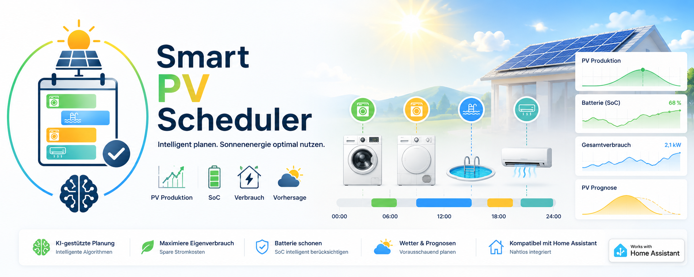

# PV Smart Scheduler



PV Smart Scheduler ist eine Home Assistant Custom Integration zur PV-optimierten Planung von Haushaltsgeraeten wie Waschmaschine, Trockner, Pool, Klimaanlage oder Whirlpool.

Die Integration erzeugt eine zentrale Entitaet `sensor.pv_smart_scheduler_zentrale`. Diese enthaelt eine priorisierte Geraeteliste mit Startempfehlung, PV-Deckung, erwarteter Energie, Batterienutzung, Laufstatus und Diagnosewerten.

## Funktionen

- Visuelle Gantt-Timeline mit konfigurierbarem Startfenster, standardmaessig 05:00 bis 23:00 Uhr
- Peak-Finder: sucht den energetisch besten Zeitpunkt, auch wenn keine 100% PV-Deckung erreichbar ist
- Adaptive Verbrauchsprofile aus der Recorder-Historie der letzten 14 Tage
- Robuste Profilspeicherung in `pv_smart_scheduler_profiles_v3.json` mit Validierung und Bereinigung entfernter Geraete
- Standby-Filter und robustes Parsing von Leistungswerten aus Status oder Attributen
- 12-Stunden-Planungshorizont mit kaskadierender Priorisierung
- Zukunftsreservierung: hoeher priorisierte Geraete blockieren ihr geplantes PV-/Batteriefenster fuer nachfolgende Geraete
- Unterstuetzung fuer PV-Prognosen in W, Solcast-Restenergie in kWh und Solcast `detailedForecast`
- Beruecksichtigung aktueller PV-Produktion in W
- Beruecksichtigung der Haus-Basislast in W
- Optionale Batterieplanung mit SoC, verfuegbarer Energie, Gesamtkapazitaet und Mindest-SoC
- Akku-Nacht-Waechter mit optionalem Nachtverbrauchs-Sensor und Diagnosegrund statt pauschaler Warnung
- Erkennung bereits laufender Geraete ueber aktuelle Leistungsaufnahme
- Geraete nachtraeglich bearbeiten oder einzeln loeschen
- Lovelace-Karte fuer die visuelle Anzeige mit automatischer Resource-Registrierung im Storage-Modus

## Benoetigte Sensoren

Pflicht:

- Geraete-Leistungssensor in W, z. B. Waschmaschine, Trockner, Pool oder Klimaanlage
- PV-Prognosesensor
- Haus-Basislast in W

Optional:

- Geraete-Statussensor, z. B. `climate.*`, `switch.*` oder `binary_sensor.*`
- Aktuelle PV-Leistung in W
- Batterie-SoC in %
- Batterie-Gesamtkapazitaet in kWh
- Verfuegbare oder aktuell gespeicherte Batterie-Energie in kWh
- Batterie-Ladeleistung in W
- Batterie-Entladeleistung in W
- Netzbezug als kumulierender kWh-Zaehler
- Netzeinspeisung als kumulierender kWh-Zaehler
- Mindest-SoC fuer Batterie-Nutzung
- Hausverbrauch Nacht in kWh
- Frueheste und spaeteste Startzeit fuer neue Geraetestarts

Solcast-Sensoren mit `unit_of_measurement: kWh` werden unterstuetzt. Wenn das Attribut `detailedForecast` vorhanden ist, nutzt die Integration die zeitaufgeloesten 30-Minuten-Werte direkt fuer die Startzeitberechnung. Ohne `detailedForecast` wird weiterhin das Attribut `estimate` als verbleibende PV-Energie genutzt und daraus eine durchschnittlich verfuegbare Leistung fuer den Planungshorizont berechnet.

## Einrichtung

1. Repository ueber HACS als Custom Repository hinzufuegen.
2. Integration installieren.
3. Home Assistant neu starten.
4. Unter Einstellungen > Geraete & Dienste > Integration hinzufuegen den PV Smart Scheduler einrichten.
5. Erstes Geraet und globale Sensoren auswaehlen.
6. Weitere Geraete ueber denselben Config Flow hinzufuegen.

## Nachtraeglich Anpassen

Ueber das Zahnrad der Integration stehen folgende Optionen zur Verfuegung:

- Globale Sensoren aendern
- Geraet bearbeiten, inklusive Entitaet, Prioritaet und Zielabdeckung
- Einzelnes Geraet loeschen

Die globalen Sensoren gelten fuer alle konfigurierten Geraete. Beim Loeschen wird nur das ausgewaehlte Geraet entfernt.

## Zentrale Entitaet

Die Entitaet `sensor.pv_smart_scheduler_zentrale` liefert unter anderem:

- `devices`: Liste aller geplanten Geraete
- `device_count`: Anzahl Geraete in der Ausgabe
- `configured_device_count`: Anzahl gespeicherter Geraete in der Konfiguration
- `unique_device_count`: Anzahl eindeutiger Leistungssensoren in der Berechnung
- `pv_current_power`: aktuelle PV-Leistung
- `battery_soc`: Batterie-Ladestand
- `battery_available_kwh`: nutzbare Batterie-Energie
- `battery_capacity_kwh`: konfigurierte oder erkannte Batterie-Gesamtkapazitaet
- `battery_min_soc`: konfigurierte Mindestreserve
- `battery_charge_power`: aktuelle Batterie-Ladeleistung
- `battery_discharge_power`: aktuelle Batterie-Entladeleistung
- `grid_import_energy_kwh`: aktueller Stand des Netzbezugszaehlers
- `grid_export_energy_kwh`: aktueller Stand des Einspeisezaehlers
- `night_consumption_sensor`: konfigurierter Sensor fuer den letzten Nachtverbrauch
- `schedule_start_time`: frueheste Startzeit fuer geplante Geraetestarts
- `schedule_end_time`: spaeteste Startzeit fuer geplante Geraetestarts
- `battery_night_warning`: `true`, wenn eine Warnung fuer die Nacht angezeigt werden soll
- `battery_night_reason`: Diagnose, warum gewarnt oder nicht gewarnt wird
- `night_usage_estimate_wh`: ermittelter oder geschaetzter Energiebedarf fuer die Nacht
- `night_usage_source`: Quelle der Nachtverbrauchsschaetzung
- `night_usage_window_start`: Start des ausgewerteten Nachtfensters bei kumulierenden Energiesensoren
- `night_usage_window_end`: Ende des ausgewerteten Nachtfensters bei kumulierenden Energiesensoren
- `forecast_source_unit`: Einheit des Forecast-Sensors
- `forecast_remaining_kwh`: verbleibende PV-Energie bei kWh-Forecast
- `forecast_average_power`: berechnete Durchschnittsleistung des verwendeten Forecasts

Pro Geraet werden unter anderem geliefert:

- `recommendation`: `ja`, `warten` oder `laeuft`
- `is_running`: Geraet laeuft aktuell
- `current_power`: aktuelle Leistung des Geraets
- `power_state`: Rohzustand des konfigurierten Leistungssensors
- `power_last_updated`: letzter Update-Zeitpunkt des Leistungssensors
- `device_state_sensor`: optionaler Statussensor des Geraets
- `device_state`: Rohzustand des Statussensors
- `best_start_time`: konkreter ISO-Zeitstempel fuer den geplanten Start
- `best_start_mins`: Minuten bis zum Start
- `duration_mins`: erwartete Programmdauer basierend auf dem gelernten Profil
- `target_coverage`: konfigurierte Zielabdeckung
- `pv_coverage`: berechnete PV-/Batterie-Deckung
- `estimated_kwh`: erwarteter Energiebedarf
- `battery_used_kwh`: eingeplante Batterie-Energie
- `weather_confidence`: Diagnosewert zur Forecast-Stabilitaet

## Technische Dokumentation

Die technische Architektur und die Scheduling-Logik sind in [docs/TECHNICAL.md](docs/TECHNICAL.md) dokumentiert.

## Lovelace-Karte

Die Karte liegt unter:

```text
/pv_smart_scheduler/pv-smart-scheduler-card.js
```

Im Standardfall muss die Ressource nicht mehr manuell unter Dashboard-Ressourcen eingetragen werden. Die Integration registriert sie in Home Assistant automatisch, wenn Lovelace im Storage-Modus laeuft.

Beispiel:

```yaml
type: custom:pv-smart-scheduler-card
entity: sensor.pv_smart_scheduler_zentrale
```

Nach Updates der Karte kann ein Browser-/App-Cache-Refresh weiterhin sinnvoll sein, die Resource-URL wird aber automatisch versioniert und von der Integration selbst gepflegt.

Wichtig:

- Automatische Registrierung funktioniert nur im Lovelace-Storage-Modus.
- Wenn du Lovelace-Ressourcen bewusst ueber YAML verwaltest, bleibt die manuelle Resource noetig.
- Falls frueher bereits eine manuelle Resource ohne Versionsquery eingetragen war, aktualisiert die Integration diese auf die aktuelle integrierte URL.
